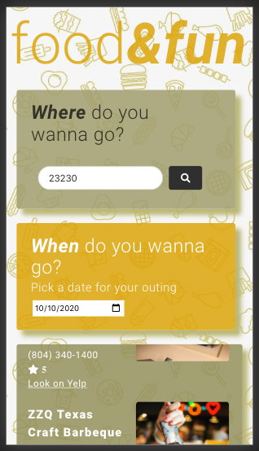

# Food&Fun: Project 1

Live Link: https://austinkst.github.io/FoodandFun/

## Background
As a person that loves finding new places to eat, and enjoying music and local events, I need an appplication that can quickly display this information. Introducing Food&Fun. We hope to answer the need for a speedy search and provide a weather forecast for your outing. The applications is responsive and displays perfectly on mobile devices.

## Food&Fun Functionality
The landing page displays a ZIP Code input field. Once the user enters a zip code for any city in the US, they are presented with a calendar to select a particular date. Once the ZIP Code and date are selected, the user is presented with 5 local restaurants, nearby events, and the weather for the city searched. The Food Tile displays the restaurant name, price range, rating, phone nubmer, and a link to Yelp for more information. In addition, they have the option of searching for more restaurants by clicking the "More Restaurants on Yelp".

Similar to the Food Tile, the Events Tile displays 5 local ticketmaster events. Each event displays the event name, link to the event, location, and link to the venue in case you want see what other events are at the venue. It also provides a link to ticketmaster at the end of the list in case the user wants to search for more events. If no events are found for the ZIP Code entered, a message is displayed and a link to ticketmaster is provided.

Desktop View

Responsive View

## Technologies Used
### Front-End
    - Html, CSS, JavaScrtip
    - Bulma
    - Google Fonts
    - Font Awesome

### Back-End
    - JavaScript
    - Open Weather API
    - Yelp API
    - ticketmaster API

## Team Members

### Front-End
    - Christine 
    - Elisabeth

### Back-End
    - Kelli
    - Giovanni

